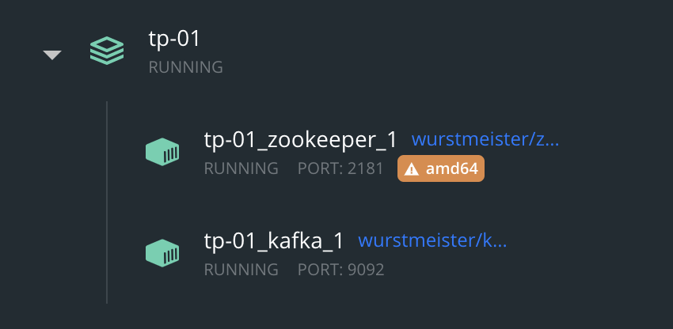

# Getting started with docker

## Prerequisite: have docker up and working

To run this tutorial, you will need Docker and Docker compose installed on your computer.

To Install docker follow this link: (<https://docs.docker.com/get-docker/>)

Docker Cheatsheet: (<https://docs.docker.com/get-started/docker_cheatsheet.pdf>)

Please be aware, docker containers are stateless, if you want to store the state you need to use Volume Mapping(<https://github.com/wurstmeister/kafka-docker/issues/511>)

## Set Kafka Cluster up and ready

* Download lab files to your computer.

* Open up your command prompt

### - Linux/Mac[*] 😍

Let's assume our *docker-compose.yml* file located in "/home/itoumlilt/Desktop/iasd-streaming-labs" on Linux/Mac.

``` bash
cd "/home/itoumlilt/Desktop/iasd-streaming-labs"
```

### - Windows[*]

Let's assume our *docker-compose.yml* file located in "C://Users/itoumlilt/Desktop/iasd-streaming-labs" on our Windows.

``` bash
cd "C://Users/itoumlilt/Desktop/iasd-streaming-labs"
```

### Start the Kafka services

Provided `docker-compose.yml` file defines two services: `zookeeper` and `kafka`.
The Kafka service is configured to expose ports 9092 and 9093.

Use `docker-compose` command along with `-d` option to run in detached (background) mode:

```bash
docker-compose up -d
```

This command will download the required Docker images and start the Kafka and Zookeeper services.

To verify that all services are up and running:

```bash
docker-compose ps
```

Output should be something like:

```bash
CONTAINER ID   IMAGE                           COMMAND                  CREATED              STATUS              PORTS                                                NAMES
f63145ba8a4a   wurstmeister/zookeeper:latest   "/bin/sh -c '/usr/sb…"   About a minute ago   Up About a minute   22/tcp, 2888/tcp, 3888/tcp, 0.0.0.0:2181->2181/tcp   tp-01_zookeeper_1
194dc89ac052   wurstmeister/kafka:latest       "start-kafka.sh"         About a minute ago   Up About a minute   0.0.0.0:9092->9092/tcp, 9093/tcp                     tp-01_kafka_1
```

You can also use your Docker Desktop app to check your images state



If one of the components usn't `Up` you can try (before calling for help)

```bash
docker-compose restart <image-name>
```

## Create your first Kafka topic

You can use the following command to create your first topic:

```bash
docker exec -it tp-01_kafka_1 /opt/kafka/bin/kafka-topics.sh --create --zookeeper zookeeper:2181 --replication-factor 1 --partitions 1 --topic first-iasd-topic
```

You may replace `tp-01_kafka_1` with the name of your kafka container id.

## Observe your changes

```bash
docker exec -it tp-01_kafka_1 /opt/kafka/bin/kafka-topics.sh --describe --zookeeper zookeeper:2181
```

You can then filter by topic using `--topic`

```bash
docker exec -it tp-01_kafka_1 /opt/kafka/bin/kafka-topics.sh --zookeeper zookeeper:2181 --describe --topic first-iasd-topic
```

You can change topic details with `--alter`

```bash
docker exec -it tp-01_kafka_1 /opt/kafka/bin/kafka-topics.sh --zookeeper zookeeper:2181 --alter --topic first-iasd-topic
```

**1st question:** how could we change retention of topic ? Is retention just time-based ?

## Produce and Consume messages

You will need to open two terminal sessions for this part, one for producer,
and a second for consumer.

### Terminal 1: Produce messages

Use the following command to start a console producer session:

```bash
docker exec -it tp-01_kafka_1 /opt/kafka/bin/kafka-console-producer.sh --broker-list localhost:9092 --topic first-iasd-topic
```

 To stop producing data, you can press Ctrl-C at any time.

### Terminal 2: Consume messages

Use the following command to start a console consumer session:

```bash
docker exec -it tp-01_kafka_1 /opt/kafka/bin/kafka-console-consumer.sh --bootstrap-server localhost:9092 --topic first-iasd-topic --from-beginning
```

**2nd question:** what is idempotency ? How could we enable idempotency on Kafka producers ?

**3rd question:** how could we change ack? What is difference between acks=0/acks=1/acks=all ?

### Terminal 2: Use consumer groups

You can also use consumer group (in such scenario your partitions will be shared across multiple consumers)

```bash
docker exec -it tp-01_kafka_1 /opt/kafka/bin/kafka-console-consumer.sh --bootstrap-server localhost:9092 --from-beginning --topic first-iasd-topic --consumer-property group.id=my-consumer-first-group
```

Please remember group-id tracked by kafka cluster, so you can see the progress on broker-side:

```bash
docker exec -it tp-01_kafka_1 /opt/kafka/bin/kafka-consumer-groups --bootstrap-server localhost:9092 --describe --group foo
```

Here you could also **observe**:

**4th question:** what happens topic with one partition consumed with multiple consumers(all consumers have same consumer group id)

**5th question:** what happens topic with ten partitions, consumed by two consumers(all consumers have same  same consumer group id)

### Custom Producer-Consumer

**Note: you can use localhost:9092 as kafka endpoint**

5.1. Use your favourite programming languages (or either provided python script) and produce random gps coordinates with order into topic called gps_locations

Latitude(Lat): [-90.00000, 90.00000], Longitude(Long): [-180.00000,180.00000]

For instance(Header:Order Lat,Long)

```
1 33.45384,135.34856
2 -39.61062,68.95387
3 -19.61062,48.32187
4 29.61062,28.94387
```

5.2. Use your favourite programming languages and consume(print) stored data (from topic called dauphine-test-topic) on Kafka broker.

5.3. How does enable.auto.commit variable changes consumer behaviour:(**6th question**)

    * set enable.auto.commit to false on consumer: it is enabled by default, make sure you generated few thousands records. Start your consumer for a second then stop it(ctrl+c), once you start again you should

### Optional: 6)kcat (formerly kafkacat)

To Install: <https://github.com/edenhill/kcat>

#### kcat: Metadata List Mode

In metadata list mode (-L), kafkacat displays metadata which includes Kafka topics, partitions, replicas and in-sync replicas (ISR).

``` bash
kcat -b localhost:9092 -L
```

if you are looking for JSON use, -J make it more prettier(you need ot have jq)

```bash
kcat -b localhost:9092 -L -J | jq .
```

#### kcat: Producer Mode

In producer mode, kafkacat reads messages from standard input (stdin).

-b broker -t topic -D delimeter(default is new line)

``` bash
kcat -b localhost:9092 -t "topic_name_should_be_here" -P
```

You can direct any file fully to kcat it will be published. Let’s assume we want to writesyslog(/var/log/syslog) file to kafka, so you can use the following command (- Linux/MAC only):

``` bash
cat /var/log/syslog | kcat -b localhost:9092 -t "topic_name_should_be_here" -z snappy
```

#### Kcat: Consumer Mode

``` bash
kcat -C -b localhost:9092 -t "topic_name_should_be_here"
```

* -e exist when finished

``` bash
kcat -C -b localhost:9092 -t "topic_name_should_be_here" -e`
```

* -o offset(starting from)

``` bash
kcat  -C -b localhost:9092 -t "topic_name_should_be_here" -o 5`
```

* -G group

``` bash
kcat -b localhost:9092 -G groupNumber1 "topic_name_should_be_here" "topic2_name_should_be_here"
```

* -p partition: -p 5 tells kafkacat to only read messages from partition 5.

``` bash
kcat -C -b localhost:9092 -t "topic_name_should_be_here" -p 5 -e
```

## Stop docker services

To clean the mess, please do:

```bash
docker-compose down
```

Or use Docker desktop to stop the containers
