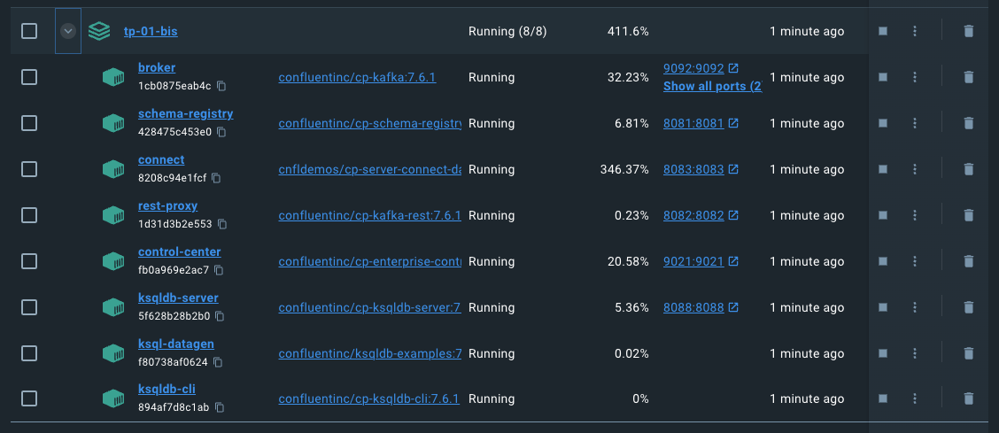

# Getting started with Docker and more advanced tools

## Prerequisite: have docker up and working

You should have the setup from `TP-01` and stopped all previous Docker images.

### Start the Kafka services

Use `docker-compose` command along with `-d` option to run in detached (background) mode:

```bash
docker-compose up -d
```

To verify that all services are up and running:

```bash
docker-compose ps
```

Output should be something like:

```bash
    Name                    Command               State                               Ports
--------------------------------------------------------------------------------------------------------------
broker            /etc/confluent/docker/run        Up      0.0.0.0:9092->9092/tcp,:::9092->9092/tcp,
                                                      0.0.0.0:9101->9101/tcp,:::9101->9101/tcp
connect           /etc/confluent/docker/run        Up      0.0.0.0:8083->8083/tcp,:::8083->8083/tcp, 9092/tcp
control-center    /etc/confluent/docker/run        Up      0.0.0.0:9021->9021/tcp,:::9021->9021/tcp
ksql-datagen      bash -c echo Waiting for K ...   Up
ksqldb-cli        /bin/sh                          Up
ksqldb-server     /etc/confluent/docker/run        Up      0.0.0.0:8088->8088/tcp,:::8088->8088/tcp
rest-proxy        /etc/confluent/docker/run        Up      0.0.0.0:8082->8082/tcp,:::8082->8082/tcp
schema-registry   /etc/confluent/docker/run        Up      0.0.0.0:8081->8081/tcp,:::8081->8081/tcp
```

You can also use your Docker Desktop app to check your images state



If one of the components usn't `Up` you can try (before calling for help)

```bash
docker-compose restart <image-name>
```

## Create your first Kafka topic

This time, we will use the Control Center UI to manage our Kafka cluster.

Navigate to the Control Center at [http://localhost:9021/](http://localhost:9021/), and wait for the cluster to load.

Click on `controlcenter.cluster` tile.

In the navigation menu, click `Topics` to show topics list.

Click on `Add Topic` to start creating `iasd-notes` topic.

You can allocate 1 partition and create with defaults.

## Create a second topic

Same process, add another `iasd-students` topic.

Question: What's the default retention time for this new topic?

## Generate data

We use [Kafka Connect](https://docs.confluent.io/platform/current/connect/index.html#connect-concepts) to generate events from an external source. Connect makes it easy to stream large volumes of data to and from a Kafka cluster.

Connector can be for example Cassandra or Elasticsearch one.

Read documentation for more information: [Link](https://docs.confluent.io/platform/current/connect/index.html#kafka-connect)

1. In the navigation menu, click `Connect`.

2. Click the `connect-default` cluster in the Connect clusters list

3. Then proceed to `Add Connector` to start creating a connector for `iasd-notes` data.

4. Select the `DatagenConnector` source.

5. Name it `datagen-iasd-notes`

Enter the following configuration values :

- Common section
  - Key Converter class: `org.apache.kafka.connect.storage.StringConverter`
- General section
  - kafka.topic: Choose `iasd-notes`
  - max.interval: 100
  - quickstart: `iasd-notes`

The click on Next to review the connector configuration, if it's ok for you, Go Launch.

You turn: now create a datagen connector for `iasd-students` with class `org.apache.kafka.connect.storage.StringConverter`.

## check messages

In the navigation menu, click Topics and in the list, click iasd-students.

Click messages to confirm that the connecter is producing data to the topic

Question: what's the format of messages? Is it formated?

## Inspect the schema of the topic

Go to your topic page, and click on Schema to inspect the one applied to your values.

Question: What's the type of schema used here?

# Final exercice

Use ksqldb to generate a stream of random 1000 students, and 3 random notes for each.
